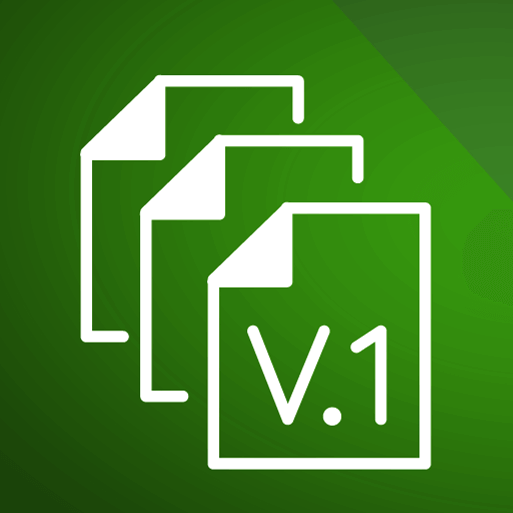

# version-endpoint
*Creates a version endpoint with git properties like SHA etc.*

[![Build][build_shield]][build_link]
[![Maintainable][maintainable_shield]][maintainable_link]
[![Coverage][coverage_shield]][coverage_link]
[![Issues][issues_shield]][issues_link]
[![Commit][commit_shield]][commit_link]
[![Dependencies][dependency_shield]][dependency_link]
[![License][license_shield]][license_link]
[![Central][central_shield]][central_link]
[![Tag][tag_shield]][tag_link]
[![Javadoc][javadoc_shield]][javadoc_link]
[![Size][size_shield]][size_shield]
![Label][label_shield]

[build_shield]: https://github.com/YunaBraska/version-endpoint/workflows/JAVA_CI/badge.svg
[build_link]: https://github.com/YunaBraska/version-endpoint/actions?query=workflow%3AJAVA_CI
[maintainable_shield]: https://img.shields.io/codeclimate/maintainability/YunaBraska/version-endpoint?style=flat-square
[maintainable_link]: https://codeclimate.com/github/YunaBraska/version-endpoint/maintainability
[coverage_shield]: https://img.shields.io/codeclimate/coverage/YunaBraska/version-endpoint?style=flat-square
[coverage_link]: https://codeclimate.com/github/YunaBraska/version-endpoint/test_coverage
[issues_shield]: https://img.shields.io/github/issues/YunaBraska/version-endpoint?style=flat-square
[issues_link]: https://github.com/YunaBraska/version-endpoint/commits/master
[commit_shield]: https://img.shields.io/github/last-commit/YunaBraska/version-endpoint?style=flat-square
[commit_link]: https://github.com/YunaBraska/version-endpoint/issues
[license_shield]: https://img.shields.io/github/license/YunaBraska/version-endpoint?style=flat-square
[license_link]: https://github.com/YunaBraska/version-endpoint/blob/master/LICENSE
[dependency_shield]: https://img.shields.io/librariesio/github/YunaBraska/version-endpoint?style=flat-square
[dependency_link]: https://libraries.io/github/YunaBraska/version-endpoint
[central_shield]: https://img.shields.io/maven-central/v/berlin.yuna/version-endpoint?style=flat-square
[central_link]:https://search.maven.org/artifact/berlin.yuna/version-endpoint
[tag_shield]: https://img.shields.io/github/v/tag/YunaBraska/version-endpoint?style=flat-square
[tag_link]: https://github.com/YunaBraska/version-endpoint/releases
[javadoc_shield]: https://javadoc.io/badge2/berlin.yuna/version-endpoint/javadoc.svg?style=flat-square
[javadoc_link]: https://javadoc.io/doc/berlin.yuna/version-endpoint
[size_shield]: https://img.shields.io/github/repo-size/YunaBraska/version-endpoint?style=flat-square
[label_shield]: https://img.shields.io/badge/Yuna-QueenInside-blueviolet?style=flat-square
[gitter_shield]: https://img.shields.io/gitter/room/YunaBraska/nats-streaming-server-embedded?style=flat-square
[gitter_link]: https://gitter.im/nats-streaming-server-embedded/Lobby

### Requirements
* `pl.project13.maven:git-commit-id-plugin` plugin which generates `${project.build.testOutputDirectory}/git.properties`
* `org.springframework.boot:spring-boot-maven-plugin` plugin which generates `${project.build.outputDirectory}/META-INF/build-info.properties`
### How to use it
```xml
<dependency>
    <groupId>berlin.yuna</groupId>
    <artifactId>version-endpoint</artifactId>
    <version>0.2.2</version>
</dependency>
```

### Configuration
```yaml
management:
  endpoint:
    version:
      path: /internal/version
        git:
          include: "*"
          exclude: tags, branch
```

### Example
```json
{
    "projectName": "version-endpoint",
    "projectGroup": "berlin.yuna",
    "projectArtifact": "version-endpoint",
    "projectVersion": "0.2.2",
    "git": {
        "tags": "",
        "build.version": "0.2.2",
        "closest.tag.commit.count": "20",
        "commit.user.name": "Yuna Morgenstern",
        "commit.id.abbrev": "a6729de",
        "branch": "testbranch",
        "build.host": "Cr15t4lF1r3",
        "commit.id.describe-short": "0.1.0-1-dirty",
        "total.commit.count": "8",
        "commit.id.describe": "0.1.0-1-ga6729de-dirty",
        "build.user.email": "git@example.com",
        "commit.id": "a6729de1f723aa3ddc84635a7cf9769dea489e17",
        "commit.message.short": "my cool commit message",
        "commit.user.email": "git@example.com",
        "closest.tag.name": "0.2.2",
        "local.branch.ahead": "0",
        "build.time": "1988-08-20T20:12:58+0100",
        "commit.time": "1988-08-20T18:22:17+0100",
        "local.branch.behind": "0",
        "build.user.name": "",
        "dirty": "true",
        "commit.message.full": "my cool commit message",
        "remote.origin.url": "https://github.com/YunaBraska/version-endpoint.git"
    }
}
```

### Troubleshooting
* BuildProperties are not initialized: just the following command 
```shell script
mvn clean compile
```

* Add spring-boot-maven-plugin if the solution above did't help 
```xml
<plugin>
    <groupId>org.springframework.boot</groupId>
    <artifactId>spring-boot-maven-plugin</artifactId>
    <version>${spring-boot.version}</version>
    <executions>
        <execution>
            <phase>compile</phase>
            <id>build-info</id>
            <goals>
                <goal>build-info</goal>
            </goals>
        </execution>
    </executions>
</plugin>                
```

### TODO
[ ] path to custom properties file

